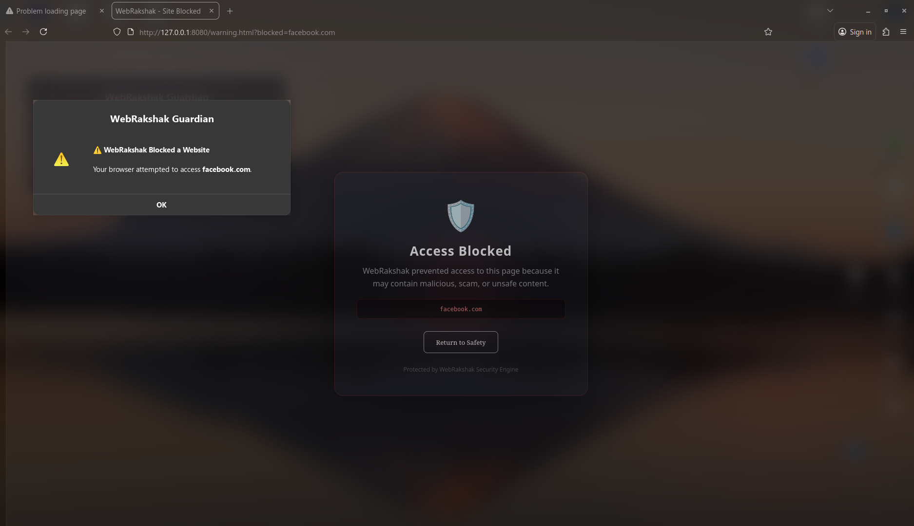

# WebRakshak

Have you ever wondered how Kaspersky- or Sophos-style software blocks websites? WebRakshak is a lightweight, educational HTTP proxy built in Go that demonstrates blocking logic and system proxy wiring without performing HTTPS man in the-middle (MITM) interception.

This repository is intentionally simple and modular, focused on Linux desktop environments. It does not intercept TLS; CONNECT requests are tunneled raw. Blocking decisions are made using a small JSON blocklist.

## TL;DR

- Purpose: Demonstrate proxy-level site blocking and system proxy wiring.
- Language: Go (module-based).
- Platform: Linux (GNOME `gsettings` used for optional system proxy toggling).
- Blocking source: `config/blocked.json` (JSON array of host substrings).
- No MITM / No certificates: TLS is not decrypted.

## Repository layout

- `main.go` — program entrypoint, loads blocklist and starts the proxy and API server.
- `config/db.go` — blocklist loading and management.
- `config/blocked.json` — JSON array of blocked host substrings.
- `internal/events` — SSE broadcaster and event logging.
- `internal/handlers` — HTTP API endpoints (telemetry, trace, uploads, SSE endpoint).
- `internal/proxy` — proxy handler and system proxy wiring.
- `ui/warning.html` — modern blocked-site warning page (served as the default UI).

## How it works (short)

1. On startup `main.go` loads `config/blocked.json` into memory.
2. The proxy (default :8081) inspects incoming `CONNECT` hostnames or regular HTTP `Host` headers.
3. If a request's host matches an entry in the blocklist, the proxy redirects the user to the built-in blocked warning page (`/` serves `ui/warning.html`).
4. If the host is not blocked, CONNECT requests are tunneled raw to the destination using `net.Dial` + `Hijack` (no TLS interception).
5. Events and telemetry are broadcast to connected clients using Server-Sent Events (SSE) at `/api/events`.

## Quickstart (Linux)

1. Ensure you have Go (1.18+ recommended). From the project root:

```bash
go build .
# or run directly
go run .
```

2. Edit `config/blocked.json` to add or remove blocked host substrings. Example:

```json
["facebook.com", "gambling.com", "unsafe.com"]
```

3. Start the proxy and UI/API services (the default `main.go` starts both). The proxy listens on `http://localhost:8081` and the warning UI is available at `http://localhost:8080/`.

Alternatively use the included run script:

```bash
chmod +x run.sh
./run.sh
```

## Notes & Extending

- The project uses a simple substring match for blocking; consider replacing it with a more accurate domain matching approach if needed.
- Telemetry and decisions are broadcast via SSE but not persisted by default.
- The system proxy toggling uses GNOME `gsettings` and is optional.

## License

MIT — see `LICENSE` if present or add your preferred license.

---

If you're learning, start by reading `internal/proxy/proxy.go` and `config/blocked.json` — those contain the core blocking and tunneling logic.

## Screenshot

Below is a screenshot of the blocked-site warning page. Add the image file to `assets/screenshot.png` in the repository root to have it render on GitHub.



## Let's build and learn together!
